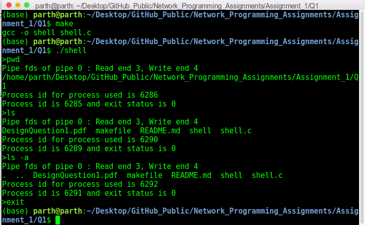

# Network Programming Assignment 1 - Part 1

This folder contains my solutions for part 1 of assignment 1 of on-campus Network Programming (IS F462) course. The file description is as follows:

1. `shell.c`: It contains implementation of a bash-like shell to execute terminal commands. 
2. `makefile`: It compiles the code to an executable file `shell`.
3. `DesignQuestion1.pdf`: It describes the various design choices made while implementing the solution.

## Steps To Run The Code:
This code is implemented in `C` language. To run it, use the commands:
```sh
make
./shell
``` 
## Introduction/Problem Statement:

The given problem asks to build a bash-like shell to execute terminal commands.

## CLI Details:
The following is a screenshot of the bash-like minimal shell implementation:



