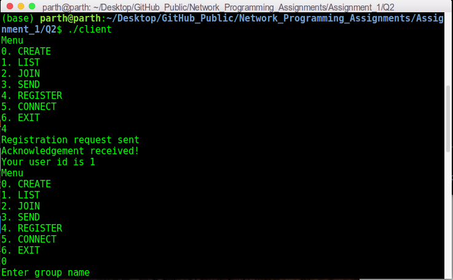
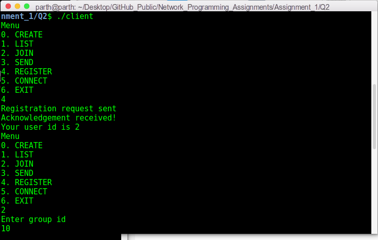
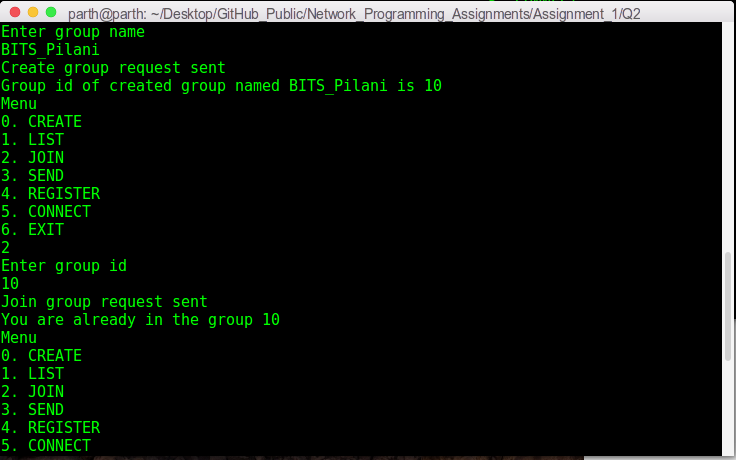
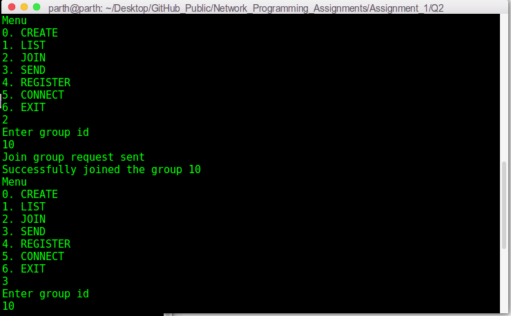
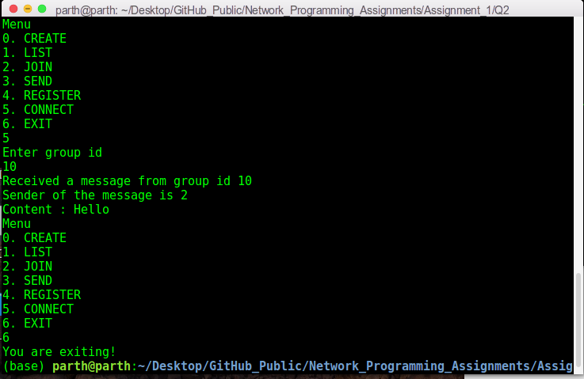
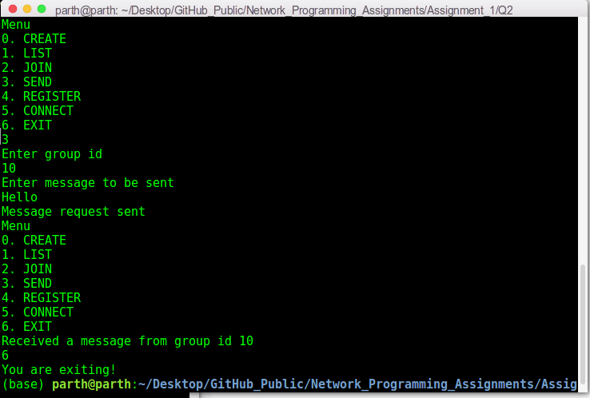

# Network Programming Assignment 1 - Part 2

This folder contains my solutions for part 2 of assignment 1 of on-campus Network Programming (IS F462) course. The file description is as follows:

1. `msgq_server.c`: It contains implementation of the server program. 
2. `msgq_client.c`: It contains implementation of the client program. 
3. `makefile`: It compiles the code to two executable files `server` and `client`.
4. `DesignQuestion2.pdf`: It describes the various design choices made while implementing the solution. It also describes the different options/actions available in the CLI while running the `client` program.

## Steps To Run The Code:
This code is implemented in `C` language. To compile it, use the command:
```sh
make
``` 
To run the server:
```sh
./server
```
To run a client:
```sh
./client
```

## Introduction/Problem Statement:

The given problem asks to design and implement a group messaging system (i.e. a server and multiple clients) using message queues. Different clients can create and join different groups and send messages to each group that they have joined. The clients cannot communicate directly with each other and the server program acts as a central authority to relay messages across different clients belonging to the same group.

## CLI Details:
The following screenshots depict communication between two clients, C1 (left) and C2 (right):

1. Both C1 and C2 register as users on the server (via option 4). They get unique user IDs from the server.

 

2. C1 creates a new group named `BITS_Pilani` (via option 0). C2 joins this group (via option 2).

 

3. C2 sends a message `Hello` to the group `BITS_Pilani` (via option 3). C1 receives the message (via option 5).

 

4. Both C1 and C2 exit the group (via option 6).

