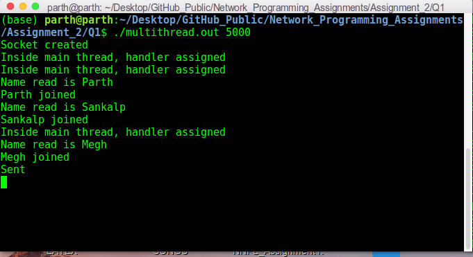
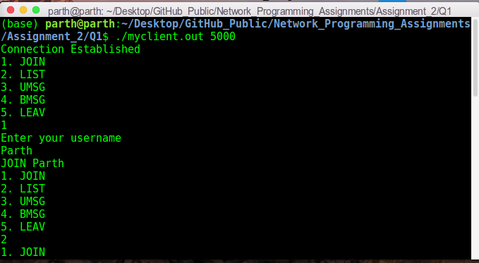
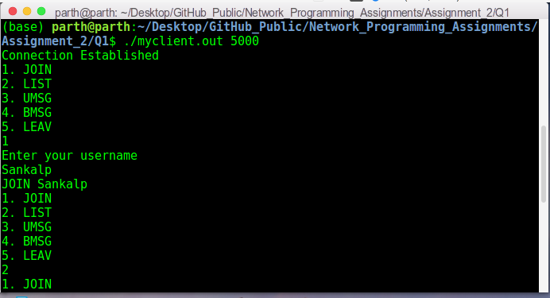
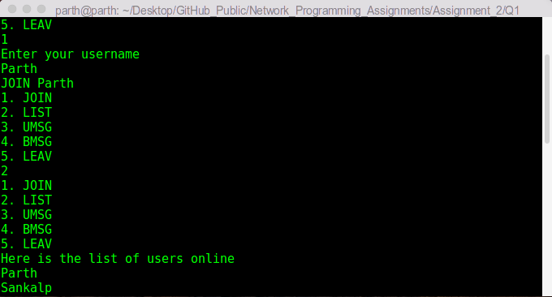
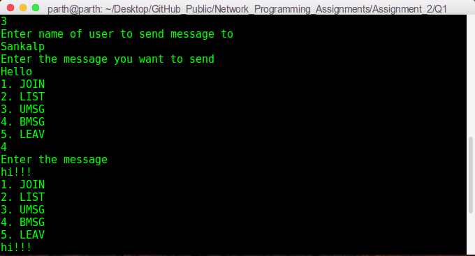
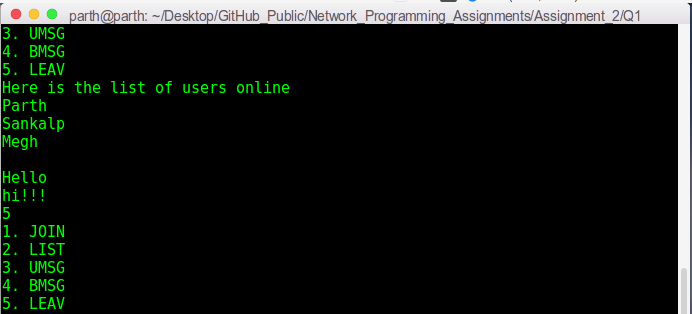

# Network Programming Assignment 2 - Part 1

This folder contains my solutions for part 1 of assignment 2 of on-campus Network Programming (IS F462) course. The file description is as follows:

1. `multithread.c`: It contains code for the multi-threaded server program.
2. `eventdriven.c`: It contains code for the event-driven server program.
3. `myclient.c`: It contains code for a custom client program (whose actions can be chosen through the CLI), which can be used to check correctness of the server programs. 
4. `client.c`: It contains code for the client program that generates uniform traffic to be sent to the server. It also generates `output.txt` and `throughput.txt` that can be used to compute average latency and throughput of the corresponding server program.
5. `makefile`: It compiles the code to executable files `multithread.out`, `event.out`, `myclient.out` and `client.out`.
6. `Assignment_2_Design_Document_Q1.pdf`: It describes the various design choices made while implementing both multithreaded and event-driven servers. It also contains a description of the client program. Finally, it compares the two servers based on average latency and throughput.

## Steps To Run The Code:
This code is implemented in `C` language. To compile the code, use the following command:
```sh
make
``` 
To run multi-threaded server, run:
```sh
./multithread.out 5000
```
To run event-driven server, run:
```sh
./event.out 5000 999
```
To run custom client, run:
```sh
./myclient.out 5000
```
To run client to generate uniform traffic for comparing performance of multi-threaded and event-driven servers, run:
```sh
./client.out 5000 N M T
```
where `N` denotes number of concurrent connections to the server, `M` denotes number of messages within a connection, and `T` denotes total number of connections to make. Above, `5000` is the port number and `999` is the `proj_id` argument of `ftok()` function (you can change them as per your need).

## Introduction/Problem Statement:

The given problem asks to compare the performance of multi-threaded and event-driven servers (on the basis of average latency and throughput) by designing a chat system. The task is to implement a multi-threaded server, an event-driven server and a client program that generates uniform traffic to be sent to the servers.

## CLI:
The following screenshots demonstrate how different clients can chat using the multi-threaded server. A similar functionality can also be achieved using the event-driven server.

First, run the server process:



Then, two users Parth and Sankalp join the chat system:




List all the users online:



Parth send the message `Hello` to Sankalp and `hi!!!` to all users online:




