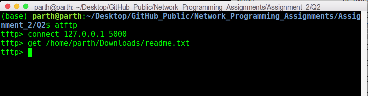
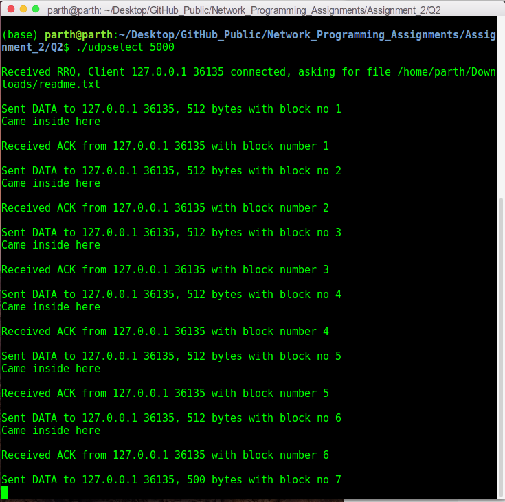

# Network Programming Assignment 2 - Part 2

This folder contains my solutions for part 2 of assignment 2 of on-campus Network Programming (IS F462) course. The file description is as follows:

1. `udp_select.c`: It contains code for the TFTP server program with constant timeout value.
2. `udp_select_timeout.c`: It contains code for the TFTP server program with dynamically-calculated timeout value.
3. `makefile`: It compiles the code to executable files `udpselect` and `udpselecttimeout`.
4. `rfc1350.pdf`: It contains RFC 1350, specifying the TFTP protocol.
5. `Assignment_2_Q2_Design_Document.pdf`: It describes the various design choices made while implementing TFTP server with both constant timeout and dynamically calculated timeout value. 

## Steps To Run The Code:
This code is implemented in `C` language. To compile the code, use the following command:
```sh
make
``` 
To run TFTP server (with a constant timeout), run:
```sh
./udpselect 5000
```
To run TFTP server with dynamically calculated timeout value, run:
```sh
./udpselecttimeout 5000
```
Above, `5000` is the port number (you can change it as per need).

## Introduction/Problem Statement:

The given problem asks to implement a TFTP (Trivial File Transfer Protocol) server that can handle Read Requests (RRQs). TFTP protocol is defined in [RFC 1350](https://www.ietf.org/rfc/rfc1350.txt). For testing purposes, use any TFTP client (like command-line program `tftp` on Linux). Also implement a dynamically calculated timeout value, by using Jacobson's algorithm to compute timeout and Karn's algorithm to update it.

## CLI:
The following screenshots show data transfer from server to client using TFTP protocol.

Client establishes a connection with the server and requests for a specific file:



Server sends the specific file to the client:



