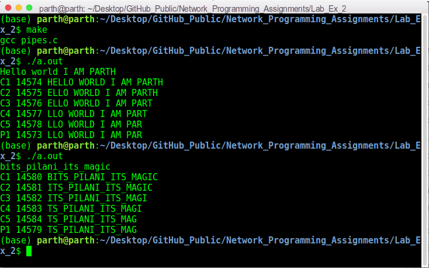

# Network Programming Lab Exercise 2

This folder contains my solutions for lab exercise 2 of on-campus Network Programming (IS F462) course. The file description is as follows:

1. `pipes.c`: It contains the solution program. 
2. `makefile`: It compiles the code to an executable file `a.out`.
3. `np182_lab2_exercise.pdf`: It describes the problem statement.

## Steps To Run The Code:
This code is implemented in `C` language. To run it, use the commands:
```sh
make
./a.out
``` 

## Overview:
This lab exercise is based on the concept of using pipes for inter-process communication.

## CLI:
The following screenshot shows two sample runs of the program:



