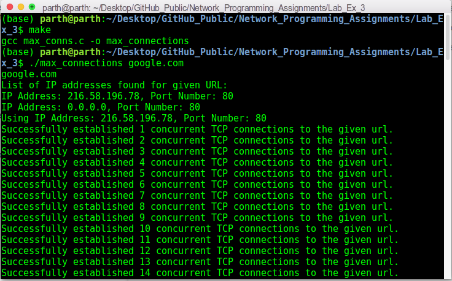
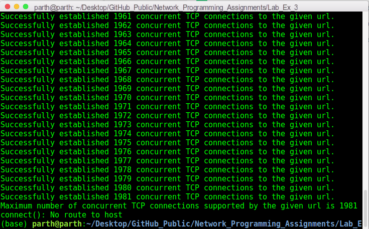

# Network Programming Lab Exercise 3

This folder contains my solutions for lab exercise 3 of on-campus Network Programming (IS F462) course. The file description is as follows:

1. `max_conns.c`: It contains the solution program. 
2. `makefile`: It compiles the code to an executable file `max_connections`.
3. `np182_lab3_exercise.pdf`: It describes the problem statement.

## Steps To Run The Code:
This code is implemented in `C` language. To run it, use the commands:
```sh
make
./max_connections WEBSITE-URL
``` 

## Overview:
This lab exercise aims to find maximum number of concurrent TCP connections supported by any website.

## CLI:
The following screenshots show maximum number of concurrent TCP connections supported by `google.com`:





