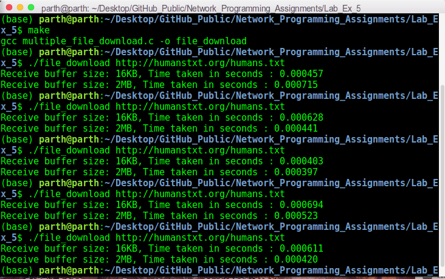

# Network Programming Lab Exercise 5

This folder contains my solutions for lab exercise 5 of on-campus Network Programming (IS F462) course. The file description is as follows:

1. `multiple_file_download.c`: It contains the solution program. 
2. `makefile`: It compiles the code to an executable file `file_download`.
3. `np182_lab5_exercise.pdf`: It describes the problem statement.

## Steps To Run The Code:
This code is implemented in `C` language. To run it, use the commands:
```sh
make
./file_download URL
``` 

## Overview:
This lab exercise aims to download a file, given the URL. It also enlarges the TCP receive buffer to download the file again, and prints the time taken to download in both cases.

## CLI:
The following screenshot shows the working of the above program:



